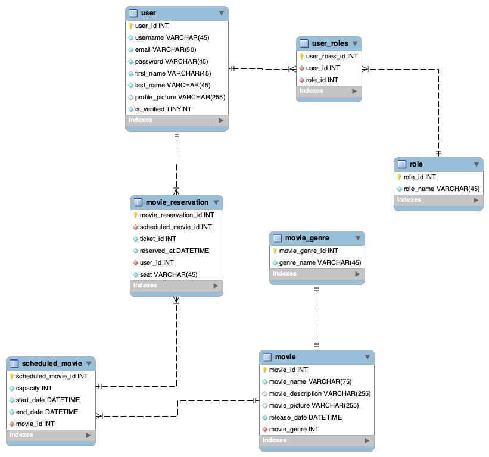

# Movie Reservation System API
Is a service that allow users to sign up, log in, browse movies, reserve seats for specific showtimes, and manage their reservations. The system features a token-based user authentication, movie and showtime management, seat reservation functionality, and a simple reporting on reservations.

The application is based on the Domain-Driven Design principles, since this approach emphasizes creating a rich domain model that reflects the business requirements.

## Node & TypeScript Configuration

1. TypeScript and dependencies
``` bash
npm i -D typescript @types/node ts-node-dev rimraf
```
2. Config TS file initialization
``` bash
npx tsc --init --outDir dist/ --rootDir src
```
3. package.json scripts definition
```JSON
"dev": "tsnd --respawn --clear src/app.ts",
"build": "rimraf ./dist && tsc",
"start": "npm run build && node dist/app.js"
```
## Database

For practical purposes, the MySQL database engine was used, and the following data model was designed:




## Prisma (MySQL)
Prisma is an opensource ORM, easy to integrate to TypeScript backend projects. The *Prisma Scheme* is defined within the _prisma/scheme.prisma_ file.

Since the data models were already created, the _instrospection_ tool was used to automatically generate de Prisma Schemes. It's basically adding Prisma to an existing data project.


You can access your database through the *Prisma Cliente*:
```
npm install @prisma/client
```

To re-generate the prisma scheme after changes in your data model, simply run:
```
prisma generate
```
Refer to [Prisma official documentation](https://www.prisma.io/docs/orm/overview).
